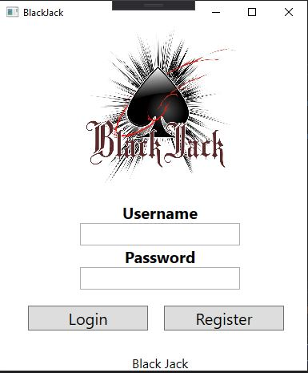
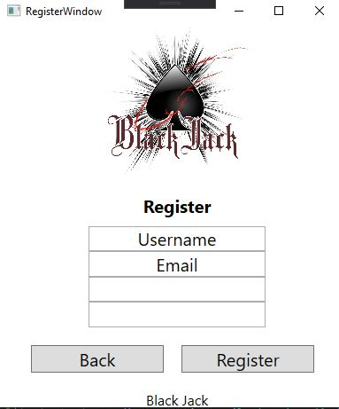
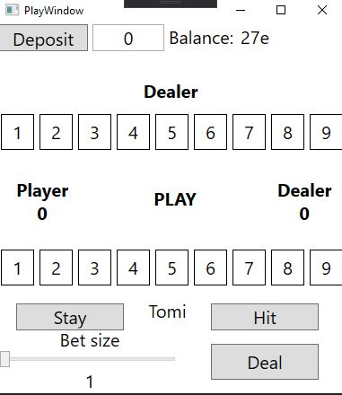

### School project blackjack

Project made with XAML and SQLite. This project includes login, register atm. Also layout in gameview. 
Video in finnish [blackjack](https://student.labranet.jamk.fi/~n3652/kayttoliityma/harjoitustyo_tietokanta.mp4)

---

# TTOS0300-Harjoitustyo

## Asennus

Asenuksessa ei tarvitse huomioida mitään pitäisi toimia ilman.

## Tietoa ohjelmasta (mitä tekee, miksi etc)

listaa toteutetut toiminnalliset vaatimukset

*Ulkoasun puolesta kaikki suht ok

*Login toimii muuten mutte en onnistunut saamaan salasana varmistusta 
(tähän tuhrautui aikaa ihan liikaa..)

*Login huomauttaa jos väärä salasana muuten ohjataan peliin

*Register toimii kaikin puolin ok

*Sähköpostin uniikki varmistminen rekitöröinnissä toimii

## Kuvaruutukaappaukset tärkeimmistä käyttöliittymistä + lyhyet käyttöohjeet jollei "ilmiselvää"

## Login

## Register

## Game

## listaa toteuttamatta jääneet toiminnalliset vaatimukset
*Peli itsessään jäi toteuttamatta meni aikaa tietokanna kanssa sähläämiseen 
en ollut ennen käyttänyt SQLiteä.

*Castaaminen ei onnistunut joten en päässyt itse peliin asti jotta olisin päässyt
tietokannan kanssa toimimaan

*Yleisesti paljon opittavaa ja ehkä ensi kerralla lähden tärkeämmästä eli 
itse pelistä...

## Mitä opittu, mitkä olivat suurimmat haasteet, mitä kannattaisi tutkia/opiskella lisää jne
oppimiset:

*SQLite

*Yleisesti XAML:lia

*Miten asennetaan ohjelmallisesti uusi tietokanta

kehitettävää:

*Datatablesta tietojen saamista pitäisi selvitellä...

## Videolinkki

[Esittely video](https://student.labranet.jamk.fi/~n3652/kayttoliityma/harjoitustyo_tietokanta.mp4)

## Tekijöiden ehdotus arvosanaksi, ja perustelut sille

Mielestäni 2:nen on varmaan ihan soveliasta pyytää tästä kun peli jäi toteuttamatta.

Selkeä ja toimiva ulkoasu. 

Login ja Register toimivat. 

Tietokanta toimii.
